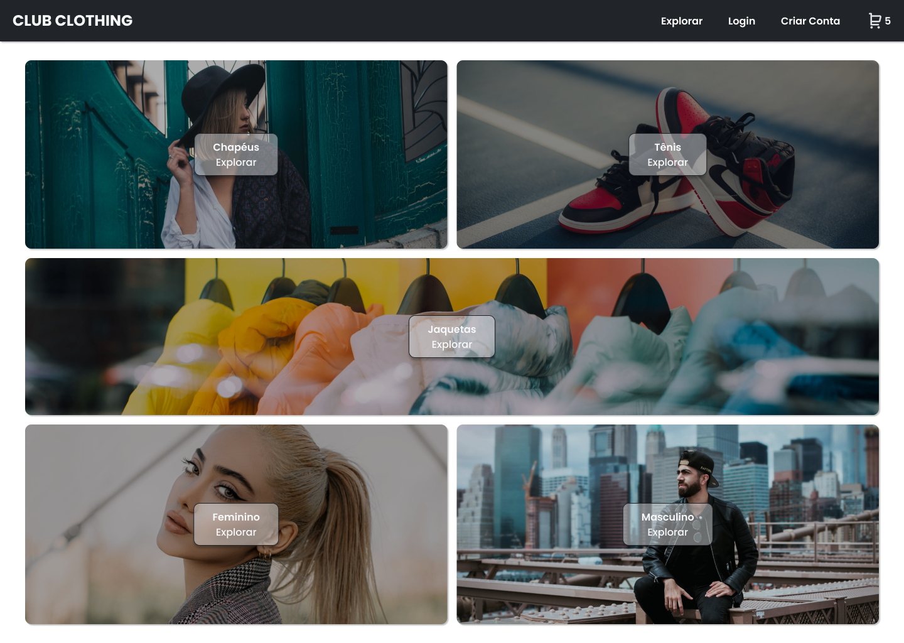

# Club Store E-commerce




> A Club Store trata-se de uma aplicação de E-commerce desenvolvida com Typescript, React, Firebase Authentication e Firestore.

### O que aprendi ?

Ao desenvolver essa aplicação, tive a oportunidade de aprender e aplicar diversos conceitos e tecnologias:

 - Componentização no React: Dividir a aplicação em componentes reutilizáveis e modulares para facilitar o desenvolvimento e manutenção do código.

 - Styled Components: Utilização de biblioteca para estilização dos componentes, tornando o CSS mais organizado e permitindo a estilização com base nas propriedades do próprio componente.

 - Validações com React Hook Form: Utilização do React Hook Form para gerenciar e validar os formulários da aplicação, tornando o processo de validação mais simples e eficiente.

 - Firebase Authentication: Implementação do sistema de autenticação utilizando o Firebase Authentication, permitindo que os usuários façam login com e-mail ou conta Google.

 - Firestore Cloud: Utilização do Firestore como banco de dados, permitindo armazenar e sincronizar dados em tempo real na aplicação.

 - Context API: Utilização da Context API do React para compartilhar dados e estados entre os componentes, resolvendo o problema de prop-drilling e tornando a gerência de estados mais eficiente.

 - Proteção de rota: Implementação de proteção de rotas, permitindo que apenas usuários autenticados acessem determinadas áreas da aplicação.

 - Integração com a API de pagamentos do Stripe: Integração com a API de pagamentos do Stripe para possibilitar a realização de transações de forma segura e confiável.


## 🚀 Como executar  

 - Node e Typescript são necessários!

Clone o projeto:
```bash
$ git clone https://github.com/Vittor-Emanoel/club-store-e-commerce.git
```


Para iniciá-lo, siga os passos abaixo:
```bash
# Instalar as dependências
$ yarn

# Iniciar o projeto
$ yarn start
```
O app estará disponível no seu browser pelo endereço http://localhost:3000.


## 📝 Licença

Esse projeto está sob licença. Veja o arquivo [LICENÇA](LICENSE.md) para mais detalhes.